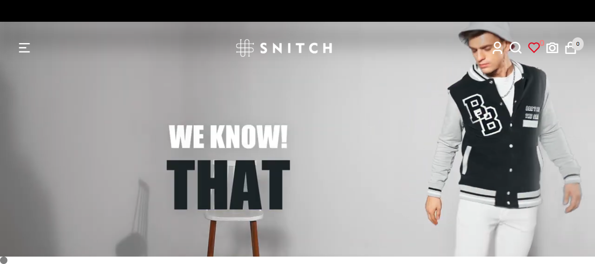

# Snitch E-commerce Clone

#### Here’s an updated description with a focus on front-end functionality:

---

The **Snitch website clone** is a front-end e-commerce design project developed from scratch. The project replicates the core look and feel of a functional e-commerce website, showcasing essential design elements and interactivity. Built with **HTML**, **CSS**, and **JavaScript**, this project emphasizes **responsive design** and **interactive features**.

## Project Overview

The Snitch clone project includes:

- **Responsive Design**: Optimized for different screen sizes to ensure usability across various devices.
- **Dynamic Menu**: A menu that responds to user interaction, enhancing navigation and accessibility.
- **Loading Screen**: An introductory loading screen that mimics professional e-commerce platforms.
- **Interactive Buttons**:
  - **Add to Cart** and **Add to Wishlist** buttons that allow basic item selection.
  - Buttons designed with interactive states, enhancing the user experience on the front end.

### Product Display

A **single product page** showcases items from a **product array**, formatted to resemble a genuine e-commerce site. At this stage, product detail pages are only **visually styled** without interactive functionality, as the current focus is on front-end design.

---

## Planned Enhancements

Moving forward, the goal is to expand the project’s interactivity by adding essential e-commerce functionality:

- **Product Filtering and Sorting**: Allow users to refine their product search based on categories, price, popularity, etc.
- **Search Functionality**: Enable a search bar to help users find products quickly.
- **Pagination**: Organize products across multiple pages for easy browsing.
- **User Interactivity Enhancements**: Add features like:
  - **Tooltips** for additional information on hover
  - **Popups** for quick previews or notifications
  - **Live Cart Updates** to reflect cart changes instantly.

These updates aim to create a fully interactive front-end e-commerce experience while continuing to focus on the client side, without integrating a backend.

## Learning Opportunities

This project offers a hands-on experience to understand the process of building a **realistic, interactive shopping platform**. The focus remains on front-end development, giving you insight into designing and implementing user-centric features, layouts, and interactivity from scratch.

---

## Project Link

You can view the live project here:
[Visit the Snitch E-commerce Clone](https://myecommerceproject-1.netlify.app/)

---

## Project Preview

> _Image: Discover Your Style - Snitch Theme_
